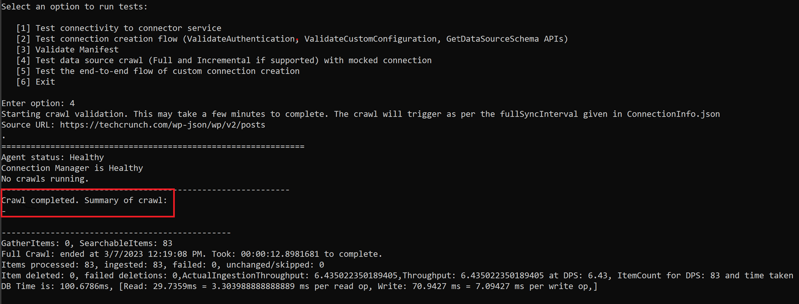
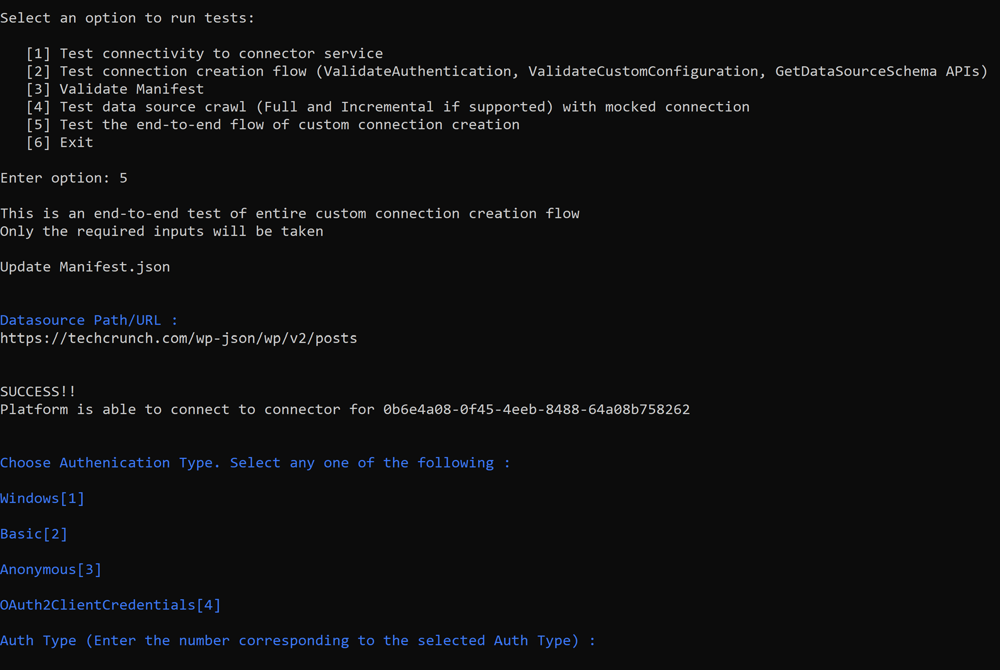

# Microsoft Graph connectors SDK test application

The GraphConnectorAgentTest executable file is a test utility for the custom connector. It doesn't create connections or add data into the Microsoft index. The test utility runs on the computer where you installed the agent and doesn't connect to external resources except for the data source that is part of the test.
You can find the test application in the TestApp folder in your Microsoft Graph connector agent installation folder.

Update the following configuration files to use this test utility:

- **ConnectionInfo.json**: This file contains all the information about the connection - the connector ID that identifies the custom connector for which this connection is being created, the data source URL, credentials to access the data source, the schema associated with the connection, and extra parameters for the connection. This configuration file is in the Config folder of the test application.

- **CustomConnectorPortMap.json**: After you create the custom connector, add the mapping of the connector ID and the port it's running on to this file. This file is in the Microsoft Graph connector agent installation folder.

  

    >[!Note]
    >You can add multiple connector IDs and their corresponding port information to this file using the \<Connector Id>:\<Port> format. Each unique connector should be running on a different port.

- **Manifest.json**: The manifest file is required in order to identify a connector and its configuration while publishing a connection through the Microsoft 365 Admin Center. Update this manifest file to use it for validation in this test application. This file is in the Config folder of the test application.

  Provide the manifest details in the following format:

    ```json
    {
      // This is the unique connector ID/provider ID.
      "connectorId": "<ConnectorGuid>",
    
      // This is a list of all supported auth types. Remove the ones that the connector does not support.
      "authTypes": [ "Windows", "Basic", "Anonymous", "OAuth2ClientCredentials" ],
      
      // The list of additional crawl types that the connector supports in addition to full and periodic full crawl. This is an optional field.
      "additionalCrawlsSupported": [ "Incremental" ]
    }

    ```

  - **connectorId** should be a GUID. This field is the same as **ConnectorUniqueId** in the Connector Info Service implementation file or the GUID that you define.
  - **AuthTypes** must be a non-empty array with one or more of the following types: `Anonymous`, `Basic`, `Windows`, `OAuth2ClientCredentials`.
  - **additionalCrawlsSupported** is optional; you can define crawl types in addition to full and periodic full crawl, depending on your implementation and the data source support. Only `Incremental` crawl is available as an option currently.

## Test scenarios

The test utility has five options:

- **Test connectivity to the connector service**: Verifies that the test utility can connect to the connector specified in ConnectionInfo.json over the port specified for that connector ID in CustomConnectorPortMap.json.


- **Test connection creation flow** (ValidateAuthentication, ValidateCustomConfiguration, GetDataSourceSchema APIs): Validates the methods specified in ConnectionManagementService. It invokes each of the methods and displays the results on the console.


- **Validate Manifest**: Validates the content of manifest.json. It checks whether the APIs related to the information provided in the manifest are implemented. The test application returns the updated manifest after validation. Use this validated manifest for further testing and use.


- **Test data source crawl with simulated connection**: Tests the methods in ConnectorCrawlerService. It invokes the crawl with the schedule specified in ConnectionInfo.json and prints the status of the ongoing or last completed crawl every minute. When the first crawl finishes successfully, it displays the message that the crawl has completed, and the platform keeps running to trigger additional crawls at the interval specified in ConnectionInfo.json. If you specify an incremental crawl frequency in the ConnectionInfo.json file, it triggers the incremental crawl after the first full crawl.



- **Test end-to-end connection publish flow**: Validates the entire flow from creating the custom connection to crawling the datasource. You will be prompted to give inputs in the same sequence as the Microsoft 365 Admin Center connection publish flow. Validation happens at every step based on your inputs.



To stop the utility from crawling the data source, close and restart the GraphConnectorAgentTest executable file. You can then choose a different test option, or retest an option after you update the connector code or the configuration files.

## How does the GraphConnectorAgentTest executable file work?

When you open the GraphConnectorAgentTest executable file, it reads the ConnectionInfo.json configuration file. After you select one of the test options, it will try to connect to the specified connector over the port indicated in the CustomConnectorPortMap configuration file. After it connects, the platform calls the relevant methods.

When you test the connection creation flow or the data source crawl, specify the credentials to access the data source in the ConnectionInfo.json configuration file. The platform reads the credentials and passes them to the connector to access the data source. As long as no one else has access to the ConnectionInfo.json configuration file, the credentials are secure.

## See also

* [Best practices](/graph/custom-connector-sdk-best-practices)
* [Troubleshooting](/graph/custom-connector-sdk-troubleshooting)
