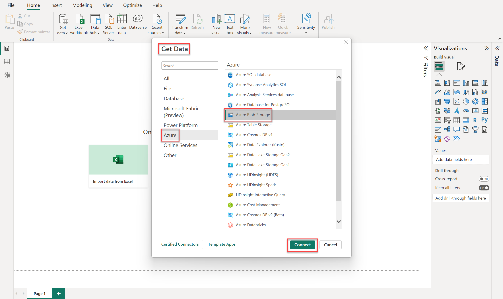
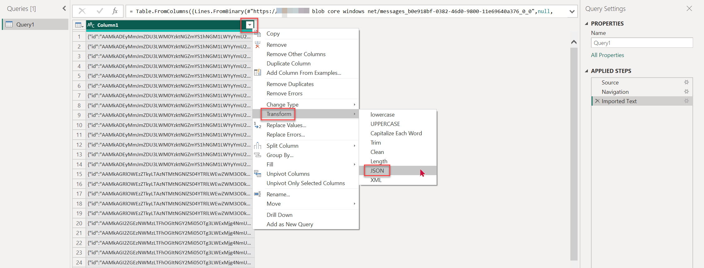

This exercise describes how to create a report in Microsoft Power BI to visualize your Microsoft 365 data from Microsoft Graph Data Connect. 

Before you proceed, make sure that you've completed the steps to build your first Microsoft Graph Data Connect application. When you have your JSON file in your Azure storage, follow these steps:

1. Open your Power BI desktop application. If you need to download Power BI, go to [Download Power BI tools and apps](https://powerbi.microsoft.com/en-us/downloads/).

2. Choose **Get Data**, select **Azure** and choose **Azure Blob Storage**.

3. Choose **Connect** to establish the connection between Power BI and your Azure Blob Storage account.

    

4. Enter the Azure Storage Account name and container name for the Azure Blob Storage account you want to connect to, and then choose **OK**.

    

> [!NOTE] 
> You can find your Azure Storage URL in the Azure Storage Account. Search through your containers, choose the container you want to connect to, go to the Context menu (...), select **Container Properties**, and copy the URL.

5. Select **Transform Data**, and select the first line that says **Binary**.

    

6. To get a list with all the **Records**, go to the Column1 toggle option, select and hold (or right-click) to select **Transform**, then choose **JSON**.

    

7. Load all the columns, expand the **Records** from the Column1 toggle, and then choose **OK**.

    

6. The results are shown as _Column1.property_. To expand the columns with nested data, choose the toggle option on each column, and then choose **OK**.

    - Choose **Close & Apply** and wait for your query to load all the columns.

    

7. After all the columns load, you can build visuals with your data.

    - Under **Data**, select **Query1** to expand the columns and choose the properties you want to visualize.
    - Under **Visualizations**, select the **Key Influencers** option to visualize the data.
    
    > [!NOTE]
    > In this example, you can determine whether users read the messages sent by a department in your organization by analyzing every **toRecipientName** and the **isRead** property.

    

8. You can now see the JSON data from the Messages_v1 data set from Microsoft Graph Data Connect in a Power BI report.

    > [!NOTE]
    > You can choose the data connectivity mode (**DirectQuery** or **Import**) depending on your data size and query requirements. We recommend that you use **DirectQuery** in this tutorial.

## See also
- For solution templates that use Microsoft Graph Data Connect built into Power BI, see the [Data Connect solutions](https://github.com/microsoftgraph/dataconnect-solutions/tree/main/solutions) repo in GitHub.